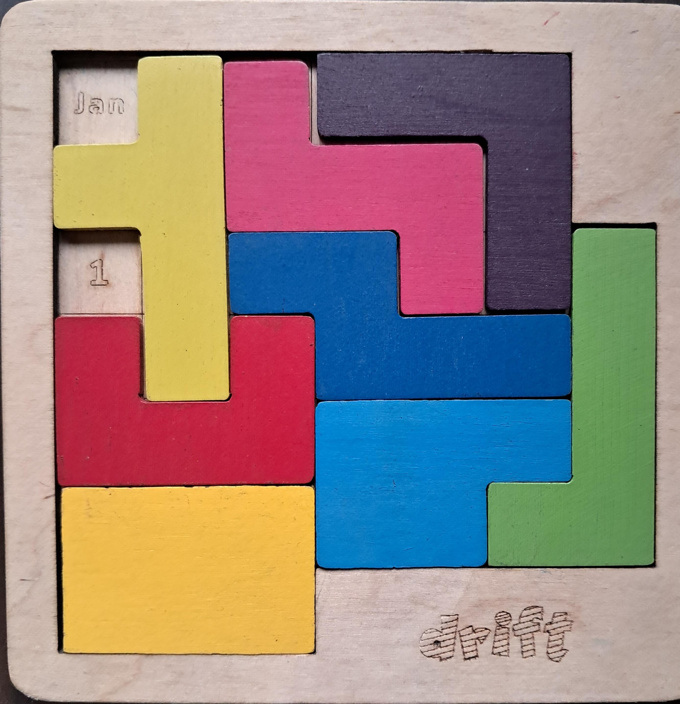

# Readme
Demonstrate Knuth's Algorithm X by solving a calendar puzzle where pieces fit together in a grid to show the date.

The notebook accompanies this [blog post](https://metterklume.github.io/puzzle/2024/12/24/calendar-puzzle.html) which explains everything.

The code can be readily adapted to any "pentomino"-type puzzle by altering the list of pieces and initial grid.

